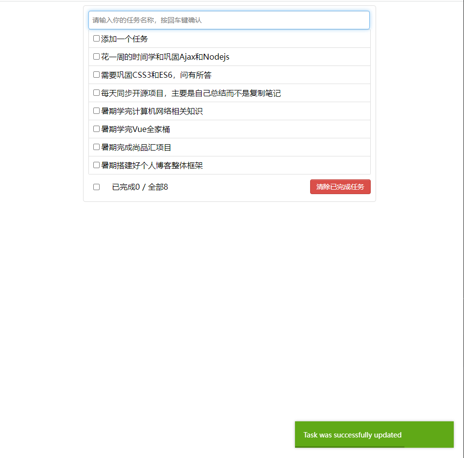

# Vue_learning

Vue2.0 跟学与总结

1. If you want to see the file structure, refer to the file 文件结构.md documentation
2. This project contains all my notes and trial-and-error on learning the Vue2.0 framework
3. todolist interface presentation：
