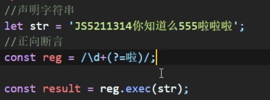
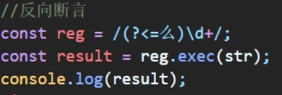

## babel 使用入门

1. 编译器&转译器
2. 用途
   - ES6->ES5 项目中代码转换成浏览器运行中的代码
   - JSX->JS
   - TS->JS
   - Flow 类型注解转换
3. @babel/preset-env 预设？
   - 一系列插件集合
   - 配置
     - 运行时环境——不同浏览器及版本
     - pollyfix——补足浏览器缺陷
4. 问：如何配置 Babel 讲 ES6 转换为 ES5？
   答案：
   内在考察：
5. 
