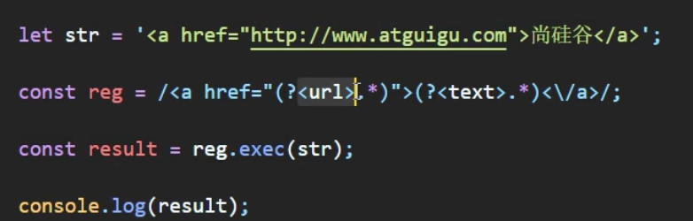

  !

# vue响应式

1. 模拟vue2的响应式
  1. 用`Object.defineProperty()`方法
  2. 第一个参数是属性所在对象
  3. 第二个参数是属性
  4. 第三个参数是对象
    1. 其中包含get方法，要有返回值
    2. 和set方法，要有值传入，要进行属性的值设置
  5. getter和setter发现不了属性的增、删
    1. 要在对象里面写`configurable:true`，就可以增删，但是并不是响应式的
2. vue3的响应式？
  1. Proxy对象，用`new Proxy()`方法，返回的也是一个对象target，和传入的一样
    - 返回的那个对象上的属性进行增删改，都能捕获到，传入的那个对象会有对应的更改
  2. 第一个参数是所指对象
  3. 第二个参数是一个配置对象，可以为空对象
    1. 其中包括get方法，要有返回值
      - 接收两个参数，第一参数是target，第二个参数是读的那个propName
    2. 和set方法，要有值传入，要进行属性的值设置
      - 接收三个参数，第一参数是target，第二个参数是改的那个propName，第三个参数是改的那个属性值
      - 记得通过`target[propName]=propValue`
      - set方法，在修改和追加的时候都会调用
    3. 还要包括deleteProperty方法
      - 接收两个参数，第一个参数是target，第二个参数是propName
      - 记得`delete target[propName]`，还要将其返回
3. 真vue3的响应式-简版
  1. 对对象的属性？`window.Reflect()`
    1. 可以读，`Reflect.get(obj,'propName')`
    2. 可以写，`Reflect.set(obj,'propName','propValue')`
    3. 可以删，`Reflect.deleteProperty(obj,'propName')`
  2. ECMA把Object上面的api添加到Reflect上，为什么？
    1. 通过`Object.defineProperty(target,'propName',{get(){},set(val){}})`添加属性，重名会报错，需要捕获
    2. 但是`Reflect.defineProperty(obj,'propName','propValue')`添加属性不会报错，会有返回值知道是否正确执行
4. 所以要看源码～～看MDN～～
  1. Proxy
  2. Reflect
5. ref和reactive
  1. [Alt text](image-8.JPG)
  2. 把所有的数据都作为参数合并为对象，传入到reactive里面
  3. reactive和ref都要导入，`import {rective,ref} from 'vue'`
  4. ref生成的是普通数据，reactive生成的是响应式数据，都是函数参数传入
6. vue2中如果组件标签传过来的值没有通过props接收，在$attrs里面也是有的
  1. 不过这样不能对类型进行限定，props是可以先定类型的
  2. $attrs只有props里面没接收的那些值
7. vue2中如果组件标签里面传过来了标签，但是子组件没有用插槽接收，在$slots里面也是有的，是default的
  1. 具名插槽：组件标签里面，要写template标签，指定slot属性
  2. 两种指定具名插槽的形式：`slot="name"`和`v-slot:name`，后者更推荐
8. vue3的setup注意点
  1. 在beforeCreate里面执行一次，this是undefined
  2. setup参数：第一个是props（给组件标签添加的属性）是proxy对象（能响应式），第二个是context（上下文，是一个对象，有attrs、emit、slots）
    1. props必须要接收，传了没接收会warn，没传的接收了是undefined，但是没警告
    2. emit触发事件，组件绑定自定义事件，方法都要写到setup里面
    3. 必须要在子组件写`emits:[]`，表示知道传过来了自定义事件
9. vue3一定要动手写，一听就会，一写就废！
10. 忘记了的点
  1. 给组件绑定的默认是自定义事件
  2. 想要给组件绑定原生事件，需要.native，如`@click.native=""`
11. vue3计算属性
  1. vue2的computed可以用setup里面的数据，vue3里面可以写computed，特点就是要一直用this
  2. vue3里面computed是一个函数，参数是一个函数，反正不用this，普通箭头都可以
  3. 计算属性的简写形式，是只读的
  4. 完整版，需要setter和getter，将对象传入computed()
12. vue3的watch
  1. vue2里面有简写形式（直接写成函数），和完整版形式（对象，有immediate、deep配置项，handler函数）
  2. **vue2的watch从来没有用到过，watch的使用场景？**
13. **vue3里面reactive和reflect的区别？都能实现响应式？**
14. 