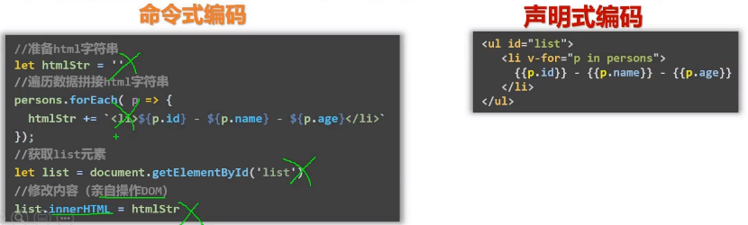
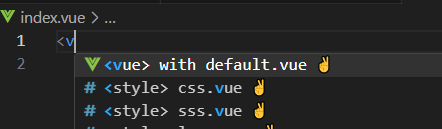
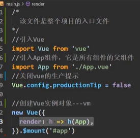
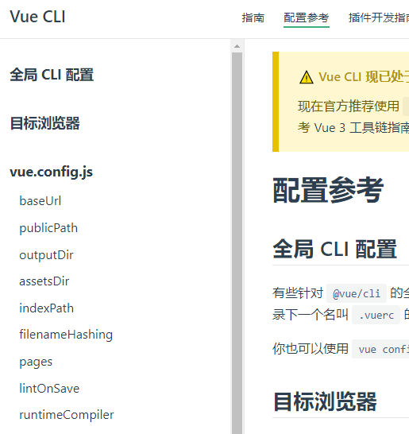
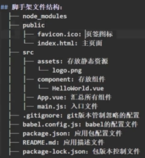
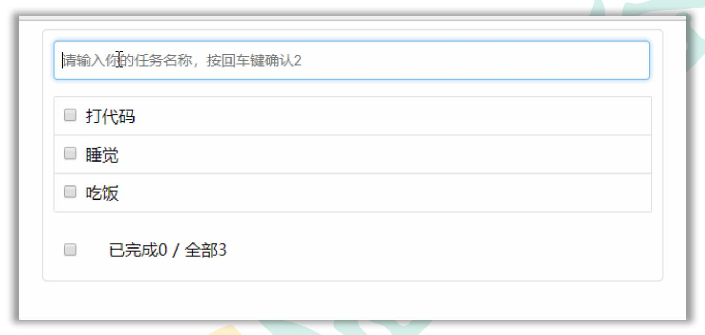

ctrl+shift+s 百度网盘截图文字识别
win+shift+s 截图 粘贴

# 个数代表几级标题

1. 有序列表

- 无序列表
  _倾斜字体_
  **加粗字体**

1. 命令式编码—声明式编码
   1. 命令式编码:编写一系列的指令和命令来描述程序的执行步骤。开发者需要详细指定每个操作的执行流程和顺序。在命令式编码中，程序员需要关注实现细节，包括控制流程、状态管理等。典型的命令式编程语言包括 `C、Java 和 Python`。
   2. 声明式编码:更关注描述问题的本质，而不是具体的解决方案。开发者需要定义期望的结果，而不是一步一步指导计算机如何达到结果。在声明式编码中，开发者更多地描述问题的逻辑和约束，而不是具体的算法或步骤。典型的声明式编程语言包括 `SQL、HTML 和 CSS`。
   3. 命令式编码更加强调控制流程和程序的状态，适合于需要精确控制和底层操作的情况。而声明式编码更加注重描述问题和结果，适合于描述数据和逻辑的结构。
2. 尚硅谷用的一些 chrome 插件
3. live server
   1. 5500 端口根资源
4. Vue 的开发者工具![Alt text]./images(image-3.png)
5. 理解生命周期解析图
6. 理解一下这里面的 bug
   1. 初始加载模板，就会调用 change 函数
   2. 调用 change 函数，就会立马修改 opacity 的值
   3. Vue 的特性，data 里面的 property 值改变，就会重新解析模板，从而再次调用 change 函数
   4. 循环，内存泄漏，指数爆炸
7. 快速生成 vue 文件
   - 快捷键，只需要输入<即可
8. main.js 文件解析
9. vue-cli 搭建的项目，配置参考-pageshttps://cli.vuejs.org/zh/config/要么就写了改，要么就别写
   - 其他：entry，lintOnSave 等
10. 如何导出文件结果
11. 实现 todolist
